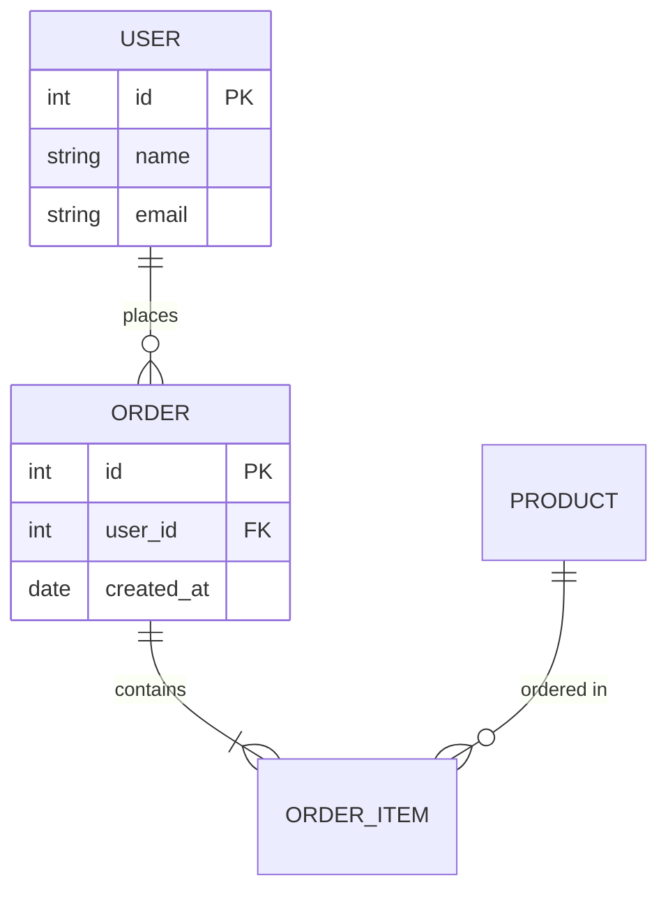

# Design Document: Technical Documentation Template

## Overview

Template tài liệu kỹ thuật chuẩn hóa dưới dạng Markdown README file. Template này cung cấp cấu trúc nhất quán để document nhiều dự án trong cùng một file hoặc riêng biệt, giúp developers và stakeholders nhanh chóng nắm bắt thông tin kỹ thuật của dự án.

## Architecture

Template sử dụng kiến trúc đơn giản dựa trên Markdown với các section lồng nhau:

```
README.md
├── Project 1
│   ├── Features
│   ├── Luồng nghiệp vụ chính (Business Flow)
│   ├── Implementation Plan
│   ├── Tech Stack Summary
│   ├── Entity Relationship
│   ├── API Endpoints Overview
│   └── Current Status
├── Project 2
│   └── (same structure)
└── ...
```

## Components and Interfaces

### 1. Project Section Component

Mỗi project được wrap trong một section với heading level 2 (`##`):

```markdown
## Project Name

### Features
- Feature 1: Mô tả ngắn
- Feature 2: Mô tả ngắn

### Luồng nghiệp vụ chính
1. Step 1: Mô tả
2. Step 2: Mô tả
3. Step 3: Mô tả

### Implementation Plan
| Phase | Tasks | Timeline |
|-------|-------|----------|
| Phase 1 | Task list | Duration |
```

### 2. Tech Stack Summary Component

```markdown
### Tech Stack Summary

| Layer | Technology |
|-------|------------|
| Frontend | React, TypeScript, TailwindCSS |
| Backend | Node.js, Express, NestJS |
| Database | PostgreSQL, Redis |
| DevOps | Docker, GitHub Actions, AWS |
```

### 3. Entity Relationship Component

Sử dụng Mermaid ER diagram:

```markdown
### Entity Relationship


```

### 4. API Endpoints Overview Component

```markdown
### API Endpoints Overview

#### Authentication Module
| Method | Endpoint | Description |
|--------|----------|-------------|
| POST | /api/auth/login | User login |
| POST | /api/auth/register | User registration |
| POST | /api/auth/logout | User logout |

#### User Module
| Method | Endpoint | Description |
|--------|----------|-------------|
| GET | /api/users | List all users |
| GET | /api/users/:id | Get user by ID |
```

### 5. Current Status Component

```markdown
### Current Status

| Aspect | Status |
|--------|--------|
| Development | 🟢 In Progress (75%) |
| Deployment | 🟡 Staging |
| Documentation | 🟢 Complete |

**Last Updated:** 2024-01-15
```

## Data Models

### Template Structure Model

```typescript
interface ProjectSection {
  name: string;
  features: Feature[];
  businessFlow: BusinessFlowStep[];
  implementationPlan: ImplementationPhase[];
  techStack: TechStackSummary;
  entityRelationship: ERDiagram;
  apiEndpoints: APIModule[];
  currentStatus: StatusInfo;
}

interface Feature {
  name: string;
  description: string;
}

interface BusinessFlowStep {
  order: number;
  description: string;
}

interface TechStackSummary {
  frontend: string[];
  backend: string[];
  database: string[];
  devops: string[];
}

interface APIModule {
  moduleName: string;
  endpoints: APIEndpoint[];
}

interface APIEndpoint {
  method: 'GET' | 'POST' | 'PUT' | 'DELETE' | 'PATCH';
  path: string;
  description: string;
}

interface StatusInfo {
  development: StatusLevel;
  deployment: DeploymentStage;
  lastUpdated: Date;
}
```

## Correctness Properties

*A property is a characteristic or behavior that should hold true across all valid executions of a system—essentially, a formal statement about what the system should do. Properties serve as the bridge between human-readable specifications and machine-verifiable correctness guarantees.*

### Property 1: Project Section Completeness

*For any* project section in the template, it SHALL contain all required subsections: Features, Business Flow, Implementation Plan, Tech Stack Summary, Entity Relationship, API Endpoints Overview, and Current Status.

**Validates: Requirements 1.3, 1.4, 1.5**

### Property 2: Tech Stack Category Coverage

*For any* Tech Stack Summary section, it SHALL contain entries for all four categories: Frontend, Backend, Database, and DevOps.

**Validates: Requirements 2.1, 2.2, 2.3, 2.4**

### Property 3: Entity Relationship Structure

*For any* Entity Relationship section, it SHALL contain at least one entity definition and use valid Mermaid ER diagram syntax.

**Validates: Requirements 3.1, 3.2, 3.3**

### Property 4: API Endpoint Structure

*For any* API endpoint entry, it SHALL include HTTP method, path, and description, grouped by module.

**Validates: Requirements 4.1, 4.2, 4.3**

### Property 5: Status Information Completeness

*For any* Current Status section, it SHALL indicate deployment status and completion progress.

**Validates: Requirements 5.1, 5.2**

## Error Handling

Vì đây là template Markdown tĩnh, error handling tập trung vào:

1. **Missing Sections**: Template phải có placeholder cho tất cả sections, ngay cả khi chưa có data
2. **Invalid Mermaid Syntax**: Cung cấp example syntax đúng để tránh render errors
3. **Incomplete Data**: Sử dụng `TBD` hoặc `N/A` cho các fields chưa có thông tin

## Testing Strategy

### Manual Validation
- Review template structure matches requirements
- Verify Mermaid diagrams render correctly
- Check all sections are present and properly formatted

### Automated Validation (Optional)
- Markdown linting để check syntax
- Mermaid syntax validation
- Structure validation script để verify required sections

Do đây là template documentation (không phải code), testing chủ yếu là manual review và validation.
