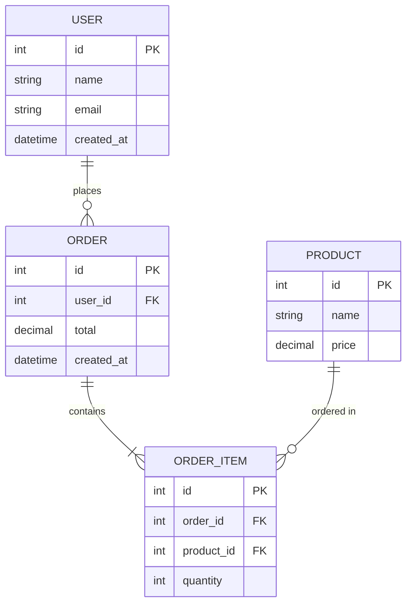
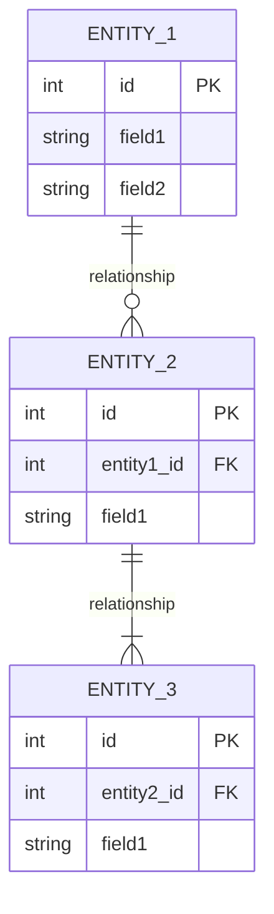

# Technical Documentation

> Template chuẩn hóa tài liệu kỹ thuật cho các dự án phần mềm

## Mục lục

- [Project 1](#project-1)
- [Project 2](#project-2)

---

## Hướng dẫn sử dụng

1. Copy template của một Project Section
2. Đổi tên project và điền thông tin tương ứng
3. Cập nhật các section: Features, Business Flow, Tech Stack, ER Diagram, API, Status
4. Thêm project mới bằng cách duplicate structure

---

## Project 1

### Features

- **Feature 1**: Mô tả ngắn gọn feature
- **Feature 2**: Mô tả ngắn gọn feature
- **Feature 3**: Mô tả ngắn gọn feature

### Luồng nghiệp vụ chính

1. **Bước 1**: Mô tả bước đầu tiên trong luồng nghiệp vụ
2. **Bước 2**: Mô tả bước tiếp theo
3. **Bước 3**: Mô tả bước kết thúc

### Implementation Plan

| Phase | Tasks | Timeline | Status |
|-------|-------|----------|--------|
| Phase 1 | Setup project, Core features | 2 weeks | ✅ Done |
| Phase 2 | API development | 3 weeks | 🔄 In Progress |
| Phase 3 | Testing & Deployment | 1 week | ⏳ Pending |

### Tech Stack Summary

| Layer | Technology |
|-------|------------|
| **Frontend** | React, TypeScript, TailwindCSS |
| **Backend** | Node.js, Express, NestJS |
| **Database** | PostgreSQL, Redis |
| **DevOps** | Docker, GitHub Actions, AWS |

### Entity Relationship

### API Endpoints Overview

#### Authentication Module

| Method | Endpoint | Description |
|--------|----------|-------------|
| POST | `/api/auth/login` | User login |
| POST | `/api/auth/register` | User registration |
| POST | `/api/auth/logout` | User logout |
| POST | `/api/auth/refresh` | Refresh token |

#### User Module

| Method | Endpoint | Description |
|--------|----------|-------------|
| GET | `/api/users` | List all users |
| GET | `/api/users/:id` | Get user by ID |
| PUT | `/api/users/:id` | Update user |
| DELETE | `/api/users/:id` | Delete user |

#### Product Module

| Method | Endpoint | Description |
|--------|----------|-------------|
| GET | `/api/products` | List all products |
| GET | `/api/products/:id` | Get product by ID |
| POST | `/api/products` | Create product |
| PUT | `/api/products/:id` | Update product |
| DELETE | `/api/products/:id` | Delete product |

### Current Status

| Aspect | Status |
|--------|--------|
| Development | 🟢 In Progress (75%) |
| Deployment | 🟡 Staging |
| Documentation | 🟢 Complete |
| Testing | 🟡 In Progress (50%) |

**Last Updated:** 2024-01-15

---

## Project 2

### Features

- **Feature 1**: Mô tả ngắn gọn feature
- **Feature 2**: Mô tả ngắn gọn feature
- **Feature 3**: Mô tả ngắn gọn feature

### Luồng nghiệp vụ chính

1. **Bước 1**: Mô tả bước đầu tiên trong luồng nghiệp vụ
2. **Bước 2**: Mô tả bước tiếp theo
3. **Bước 3**: Mô tả bước kết thúc

### Implementation Plan

| Phase | Tasks | Timeline | Status |
|-------|-------|----------|--------|
| Phase 1 | Setup project, Core features | 2 weeks | ⏳ Pending |
| Phase 2 | API development | 3 weeks | ⏳ Pending |
| Phase 3 | Testing & Deployment | 1 week | ⏳ Pending |

### Tech Stack Summary

| Layer | Technology |
|-------|------------|
| **Frontend** | Vue.js, TypeScript, Vuetify |
| **Backend** | Python, FastAPI |
| **Database** | MongoDB, Redis |
| **DevOps** | Docker, GitLab CI, GCP |

### Entity Relationship

### API Endpoints Overview

#### Module 1

| Method | Endpoint | Description |
|--------|----------|-------------|
| GET | `/api/resource` | List resources |
| GET | `/api/resource/:id` | Get resource by ID |
| POST | `/api/resource` | Create resource |
| PUT | `/api/resource/:id` | Update resource |
| DELETE | `/api/resource/:id` | Delete resource |

#### Module 2

| Method | Endpoint | Description |
|--------|----------|-------------|
| GET | `/api/other` | List items |
| POST | `/api/other` | Create item |

### Current Status

| Aspect | Status |
|--------|--------|
| Development | ⏳ Not Started (0%) |
| Deployment | 🔴 Not Deployed |
| Documentation | 🟡 In Progress |
| Testing | 🔴 Not Started |

**Last Updated:** 2024-01-15

---

## Legend

| Icon | Meaning |
|------|---------|
| 🟢 | Complete / Active |
| 🟡 | In Progress / Staging |
| 🔴 | Not Started / Error |
| ⏳ | Pending |
| ✅ | Done |
| 🔄 | In Progress |
