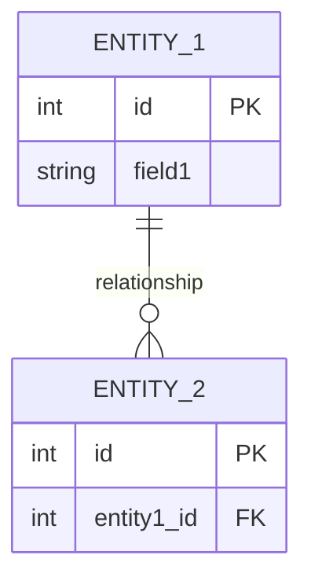

# Travel Mentor

> Hệ thống tư vấn và hướng dẫn du lịch

---

## Features

- **Feature 1**: Mô tả feature
- **Feature 2**: Mô tả feature
- **Feature 3**: Mô tả feature

## Luồng nghiệp vụ chính

1. **Bước 1**: Mô tả bước đầu tiên
2. **Bước 2**: Mô tả bước tiếp theo
3. **Bước 3**: Mô tả bước kết thúc

## Implementation Plan

| Phase | Tasks | Timeline | Status |
|-------|-------|----------|--------|
| Phase 1 | Setup project | 2 weeks | ⏳ Pending |
| Phase 2 | Core features | 3 weeks | ⏳ Pending |
| Phase 3 | Testing & Deployment | 1 week | ⏳ Pending |

## Tech Stack Summary

| Layer | Technology |
|-------|------------|
| **Frontend** | TBD |
| **Backend** | TBD |
| **Database** | TBD |
| **DevOps** | TBD |

## Entity Relationship

## API Endpoints Overview

### Module 1

| Method | Endpoint | Description |
|--------|----------|-------------|
| GET | `/api/resource` | List resources |
| POST | `/api/resource` | Create resource |

## Current Status

| Aspect | Status |
|--------|--------|
| Development | ⏳ Not Started (0%) |
| Deployment | 🔴 Not Deployed |
| Documentation | 🟡 In Progress |

**Last Updated:** 2024-01-15
