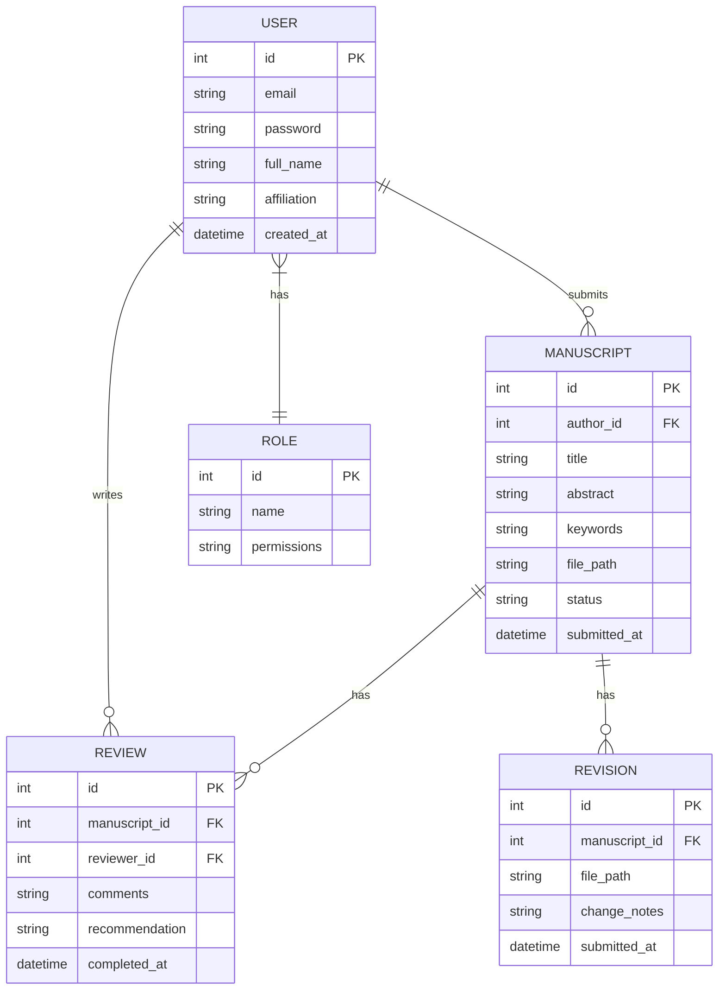

# Web OJS - Hệ thống Tạp chí Khoa học Trực tuyến

> Nền tảng quản lý và xuất bản tạp chí học thuật toàn diện, hỗ trợ quy trình từ nộp bản thảo, phản biện đến xuất bản chính thức.

---

## Features

- **Quản lý người dùng**: Xác thực, phân quyền và quản lý hồ sơ người dùng (Tác giả, Biên tập viên, Phản biện)
- **Hệ thống nộp bài**: Upload bản thảo và quản lý metadata
- **Hệ thống phản biện**: Quản lý quy trình peer review
- **Hệ thống xuất bản**: Xuất bản và hiển thị bài báo công khai
- **Hệ thống thông báo**: Gửi email thông báo đến người dùng
- **Dashboard**: Giao diện cá nhân hóa theo vai trò người dùng

## Luồng nghiệp vụ chính

1. **Nộp bản thảo**: Tác giả đăng ký/đăng nhập → Upload bản thảo → Điền metadata
2. **Phân công phản biện**: Biên tập viên nhận bản thảo → Phân công Phản biện viên
3. **Phản biện**: Phản biện viên đánh giá → Gửi nhận xét và đề xuất
4. **Quyết định xuất bản**: Biên tập viên xem xét → Chấp nhận/Từ chối/Yêu cầu chỉnh sửa
5. **Chỉnh sửa (nếu có)**: Tác giả chỉnh sửa theo góp ý → Nộp lại
6. **Xuất bản**: Bài báo được chấp nhận → Xuất bản công khai

## Implementation Plan

| Phase | Tasks | Timeline | Status |
|-------|-------|----------|--------|
| Phase 1 | Setup project, User Management | 2 tuần | ⏳ Pending |
| Phase 2 | Submission System | 2 tuần | ⏳ Pending |
| Phase 3 | Review System | 3 tuần | ⏳ Pending |
| Phase 4 | Publication System | 2 tuần | ⏳ Pending |
| Phase 5 | Notification System | 1 tuần | ⏳ Pending |
| Phase 6 | Testing & Deployment | 2 tuần | ⏳ Pending |

## Tech Stack Summary

| Layer | Technology |
|-------|------------|
| **Frontend** | Next.js, React, TypeScript, TailwindCSS |
| **Backend** | Java, Spring Boot, Spring Security |
| **Database** | PostgreSQL, Redis (cache) |
| **DevOps** | Docker, GitHub Actions, AWS/GCP |

## Thuật ngữ

| Thuật ngữ | Mô tả |
|-----------|-------|
| **WebOJS** | Hệ thống Tạp chí Khoa học Trực tuyến đang phát triển |
| **Author (Tác giả)** | Người dùng nộp bản thảo đến tạp chí |
| **Editor (Biên tập viên)** | Người quản lý quy trình biên tập và quyết định xuất bản |
| **Reviewer (Phản biện viên)** | Người đánh giá bản thảo và đưa ra nhận xét |
| **Manuscript (Bản thảo)** | Tài liệu được tác giả nộp để xem xét xuất bản |

## Entity Relationship

## API Endpoints Overview

### Authentication Module

| Method | Endpoint | Mô tả |
|--------|----------|-------|
| POST | `/api/auth/register` | Đăng ký tài khoản |
| POST | `/api/auth/login` | Đăng nhập |
| POST | `/api/auth/logout` | Đăng xuất |
| POST | `/api/auth/refresh` | Làm mới token |
| POST | `/api/auth/forgot-password` | Quên mật khẩu |

### User Module

| Method | Endpoint | Mô tả |
|--------|----------|-------|
| GET | `/api/users/profile` | Lấy thông tin cá nhân |
| PUT | `/api/users/profile` | Cập nhật thông tin |
| GET | `/api/users` | Danh sách người dùng (Admin) |
| PUT | `/api/users/:id/role` | Phân quyền người dùng |

### Manuscript Module

| Method | Endpoint | Mô tả |
|--------|----------|-------|
| POST | `/api/manuscripts` | Nộp bản thảo mới |
| GET | `/api/manuscripts` | Danh sách bản thảo |
| GET | `/api/manuscripts/:id` | Chi tiết bản thảo |
| PUT | `/api/manuscripts/:id` | Cập nhật bản thảo |
| DELETE | `/api/manuscripts/:id` | Xóa bản thảo |
| POST | `/api/manuscripts/:id/revision` | Nộp bản chỉnh sửa |

### Review Module

| Method | Endpoint | Mô tả |
|--------|----------|-------|
| POST | `/api/manuscripts/:id/assign-reviewer` | Phân công phản biện |
| GET | `/api/reviews/pending` | Danh sách chờ phản biện |
| POST | `/api/reviews/:id` | Gửi nhận xét phản biện |
| PUT | `/api/manuscripts/:id/decision` | Quyết định xuất bản |

### Publication Module

| Method | Endpoint | Mô tả |
|--------|----------|-------|
| POST | `/api/manuscripts/:id/publish` | Xuất bản bài báo |
| GET | `/api/publications` | Danh sách bài đã xuất bản |
| GET | `/api/publications/:id` | Chi tiết bài xuất bản |

## Current Status

| Aspect | Status |
|--------|--------|
| Development | ⏳ Not Started (0%) |
| Deployment | 🔴 Not Deployed |
| Documentation | 🟡 In Progress |
| Testing | 🔴 Not Started |

**Last Updated:** 2024-01-15
